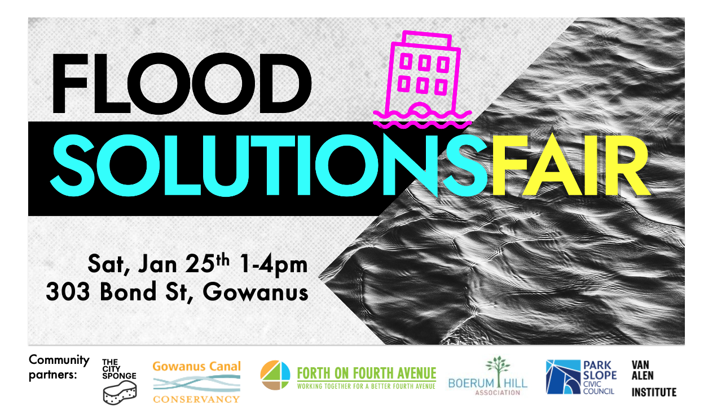

## Flooding Solutions Fair - Sat January 25th - FREE
Hosted by The City Sponge; FOFA co-sponsors with many other community partners

Like many parts of NYC, the neighborhoods around our area are hit hard by flooding when it happens.  Given more water is predicted, we are proud to be a community parter for the the "Flood Solutions Fair": a free community event to help you see what you can do - in your place and in your community.
<!--more--> 
Come browse solutions and ask questions of experts at tables which will include plumbers, landscapers, masons, basement waterproofers, insurance experts and non-profits who know *what what you can do*
…and gov’t programs to help you mitigate.  
There will also be community discussions which include local elected officials and policy experts to share what they see and hear what you think and need. And share your flooding story as part of the Dear Neighbors public art project.  

**FREE.  Come for 15 min or stay for 3 hours.**

Flooding Solutions Fair - Sat January 25, 1-4pm - Van Alen (303 Bond St)
Space is limited to register here:
 
https://www.eventbrite.com/e/flood-solutions-fair-tickets-1116762198799?aff=4fofa

Produced 
by The City Sponge and in partnership with Gowanus Canal Conservancy, Forth on Fourth Avenue, Park Slope Civic Council, Boreum Hill Association, and Van Alen Institute.  

